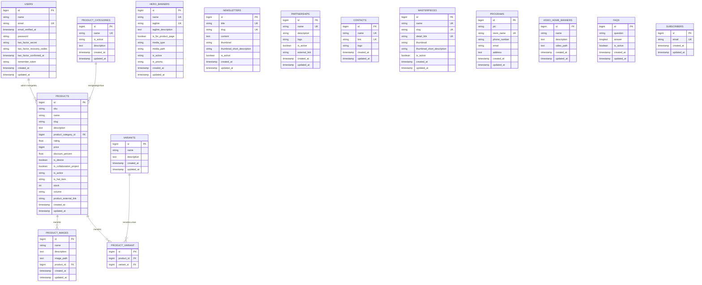

# Tigac.id

Website resmi **Tigac.id** — dibangun dengan Laravel 10. Aplikasi ini terdiri dari dua bagian utama: **frontend publik** (etalase produk, program, partnership, newsletter, FAQ, dll) dan **panel admin** (CRUD untuk seluruh konten dinamis situs).

---

## Daftar Isi

- [Tech Stack](#tech-stack)
- [Prasyarat](#prasyarat)
- [Instalasi](#instalasi)
- [Struktur Direktori](#struktur-direktori)
- [Entity Relationship Diagram (ERD)](#entity-relationship-diagram-erd)
- [Skema Database](#skema-database)
- [Daftar Rute](#daftar-rute)
  - [Rute Frontend](#rute-frontend-publik)
  - [Rute Admin / Backend](#rute-admin--backend-butuh-login)
- [Autentikasi](#autentikasi)
- [Perintah Artisan yang Sering Dipakai](#perintah-artisan-yang-sering-dipakai)
- [Troubleshooting](#troubleshooting)

---

## Tech Stack

| Layer        | Teknologi                                             |
| ------------ | ----------------------------------------------------- |
| Framework    | Laravel 10.x                                          |
| PHP          | ^8.1                                                  |
| Database     | MySQL 5.7+ / MariaDB 10.3+                            |
| Auth         | Laravel Fortify + Sanctum                             |
| Frontend     | Blade + Vite + Axios                                  |
| Build tool   | Vite 5                                                |
| Tabel admin  | `yajra/laravel-datatables` + buttons                  |
| Notifikasi   | `realrashid/sweet-alert`                              |
| HTTP client  | GuzzleHTTP 7                                          |

---

## Prasyarat

- PHP ≥ 8.1 dengan ekstensi: `pdo_mysql`, `mbstring`, `openssl`, `tokenizer`, `xml`, `ctype`, `json`, `bcmath`, `fileinfo`, `gd`
- Composer 2.x
- Node.js ≥ 18 & NPM
- MySQL / MariaDB

---

## Instalasi

```bash
# 1. Clone repository
git clone <repo-url> tigac.id
cd tigac.id

# 2. Install dependencies
composer install
npm install

# 3. Siapkan file environment
cp .env.example .env
php artisan key:generate

# 4. Konfigurasikan database di .env
#    DB_DATABASE=db_tigac
#    DB_USERNAME=root
#    DB_PASSWORD=

# 5. Jalankan migrasi (+ seeder jika ada)
php artisan migrate

# 6. Link storage supaya upload gambar bisa diakses publik
php artisan storage:link
#    Alternatif lewat browser: buka http://localhost:8000/linkstorage

# 7. Jalankan server dev
php artisan serve       # backend (http://localhost:8000)
npm run dev             # vite (asset hot reload)
```

---

## Struktur Direktori

```
tigac.id/
├── app/
│   ├── Http/Controllers/     # 15 controller (frontend + admin)
│   └── Models/               # 15 Eloquent model
├── database/
│   └── migrations/           # Skema seluruh tabel
├── public/                   # Entry point + asset publik
├── resources/
│   └── views/
│       ├── pages/frontend/   # Blade halaman publik
│       └── pages/admin/      # Blade panel admin
├── routes/
│   ├── web.php               # Seluruh rute web (frontend + admin)
│   └── api.php               # Endpoint API (Sanctum)
└── storage/app/public/       # Upload gambar/video
```

---

## Entity Relationship Diagram (ERD)



> Entitas `HERO_BANNERS`, `NEWSLETTERS`, `PARTNERSHIPS`, `CONTACTS`, `MASTERPIECES`, `PROGRAMS`, `VIDEO_HOME_BANNERS`, `FAQS`, dan `SUBSCRIBERS` bersifat **standalone** (tidak memiliki relasi FK ke entitas lain). Mereka dikelola penuh lewat panel admin.

### Relasi Inti (Product Domain)

```
product_categories (1) ────< (M) products
products            (1) ────< (M) product_images
products            (M) ────< (M) variants      [pivot: product_variant]
```

---

## Skema Database

| Tabel                | Deskripsi                                                            |
| -------------------- | -------------------------------------------------------------------- |
| `users`              | Akun admin (Fortify + 2FA kolom dari Jetstream).                     |
| `product_categories` | Kategori produk, terhubung ke `products` (1:M).                      |
| `products`           | Master produk. `slug` di-generate otomatis dari `name` di model.     |
| `product_images`     | Galeri gambar produk (1 produk → banyak gambar).                     |
| `variants`           | Daftar varian (misal: rasa, ukuran).                                 |
| `product_variant`    | Pivot M:M antara `products` dan `variants`.                          |
| `hero_banners`       | Banner hero untuk home page & halaman produk.                        |
| `video_home_banners` | Video banner di halaman home.                                        |
| `newsletters`        | Artikel / konten newsletter (dengan slug SEO-friendly).              |
| `partnerships`       | Daftar partner / brand kolaborasi.                                   |
| `contacts`           | Link kontak / social media (logo + link).                            |
| `masterpieces`       | Showcase "masterpiece" / highlight produk pilihan.                   |
| `programs`           | Pendaftaran program (toko/reseller) dari form publik.                |
| `faqs`               | Pertanyaan yang sering ditanyakan.                                   |
| `subscribers`        | Email pelanggan newsletter.                                          |

---

## Daftar Rute

### Rute Frontend (publik)

Semua rute di bawah memakai prefix nama `pages.frontend.*`.

| Method | URI                         | Nama                             | Controller / Aksi                            |
| ------ | --------------------------- | -------------------------------- | -------------------------------------------- |
| GET    | `/`                         | `pages.frontend.index`           | `HomePageController@index`                   |
| GET    | `/product`                  | `pages.frontend.product`         | `ProductController@frontEndPage`             |
| GET    | `/product/{slug}`           | `pages.frontend.product.detail`  | `ProductController@productDetailPage`        |
| GET    | `/program`                  | `pages.frontend.program`         | `ProgramController@frontEndPage`             |
| POST   | `/program`                  | `pages.frontend.program.store`   | `ProgramController@store`                    |
| GET    | `/newsletter`               | `pages.frontend.newsletter`      | `NewsletterController@frontEndPage`          |
| GET    | `/partnership`              | `pages.frontend.partnership`     | `PartnershipController@frontEndPage`         |
| GET    | `/faq`                      | `pages.frontend.faq`             | `FaqController@frontEndPage`                 |
| GET    | `/discover`                 | `pages.frontend.discover`        | view `pages.frontend.about`                  |
| GET    | `/about`                    | `pages.frontend.about`           | view `pages.frontend.about`                  |
| GET    | `/vaporistar`               | `pages.frontend.vaporistar`      | view `pages.frontend.vaporistar`             |
| GET    | `/contact`                  | `pages.frontend.contact`         | view `pages.frontend.contact`                |
| GET    | `/find`                     | `pages.frontend.find`            | view `pages.frontend.find`                   |
| GET    | `/tcall`                    | `pages.frontend.tcall`           | view `pages.frontend.tcall`                  |
| GET    | `/consumer-program`         | `pages.frontend.consumer.program`| view `pages.frontend.consumerProgram`        |
| GET    | `/landing`                  | `pages.landing`                  | view `pages.landing`                         |
| GET    | `/qr`                       | `pages.qr`                       | view `pages.qr`                              |
| -      | `/subscriber` (resource)    | `pages.frontend.subscriber.*`    | `SubscriberController` (RESTful)             |
| GET    | `/linkstorage`              | —                                | Jalankan `storage:link` sekali pakai         |

### Rute Admin / Backend (butuh login)

Semua rute di bawah dilindungi middleware **`auth`**.

#### Dashboard

| Method | URI      | Nama          | Controller                         |
| ------ | -------- | ------------- | ---------------------------------- |
| GET    | `/admin` | `admin.index` | `AdminDashboardController@index`   |

#### Product Category

| Method | URI                                                          | Nama                                                    |
| ------ | ------------------------------------------------------------ | ------------------------------------------------------- |
| GET    | `/admin/products/categories`                                 | `admin.product.product-category.index`                  |
| GET    | `/admin/products/categories/create`                          | `admin.product.product-category.create`                 |
| POST   | `/admin/products/categories/store`                           | `admin.product.product-category.store`                  |
| GET    | `/admin/products/categories/{id}/edit`                       | `admin.product.product-category.edit`                   |
| PUT    | `/admin/products/categories/{id}/update`                     | `admin.product.product-category.update`                 |
| DELETE | `/admin/products/categories/destroy/{id}`                    | `admin.product.product-category.destroy`                |
| PUT    | `/admin/products/categories/chagne-active-status/{id}`       | `admin.product.product-category.change-active-status`   |

#### Product Variant

| Method | URI                                            | Nama                                    |
| ------ | ---------------------------------------------- | --------------------------------------- |
| GET    | `/admin/products/variants`                     | `admin.product.product-variant.index`   |
| GET    | `/admin/products/variants/create`              | `admin.product.product-variant.create`  |
| POST   | `/admin/products/variants/store`               | `admin.product.product-variant.store`   |
| GET    | `/admin/products/variants/detail/{id}`         | `admin.product.product-variant.show`    |
| GET    | `/admin/products/variants/edit/{id}`           | `admin.product.product-variant.edit`    |
| PUT    | `/admin/products/variants/update/{id}`         | `admin.product.product-variant.update`  |
| DELETE | `/admin/products/variants/destroy/{id}`        | `admin.product.product-variant.destroy` |

#### Resource Routes (standard RESTful `index/create/store/show/edit/update/destroy`)

| Resource            | URI base                     | Nama prefix                 |
| ------------------- | ---------------------------- | --------------------------- |
| Products            | `/admin/products`            | `admin.products.*`          |
| Hero Banners        | `/admin/hero-banners`        | `admin.hero-banners.*`      |
| Newsletters         | `/admin/newsletters`         | `admin.newsletters.*`       |
| Partnerships        | `/admin/partnerships`        | `admin.partnerships.*`      |
| Contacts            | `/admin/contacts`            | `admin.contacts.*`          |
| Masterpieces        | `/admin/masterpieces`        | `admin.masterpieces.*`      |
| Programs            | `/admin/programs`            | `admin.programs.*`          |
| Video Home Banners  | `/admin/video-home-banners`  | `admin.video-home-banners.*`|
| FAQs                | `/admin/faqs`                | `admin.faqs.*`              |
| User Management     | `/userManagement`            | `userManagement.*`          |

#### Rute Admin Tambahan

| Method | URI                                                       | Nama                                 |
| ------ | --------------------------------------------------------- | ------------------------------------ |
| DELETE | `/admin/products/{productId}/images/{productImagesId}/destroy` | `admin.products.images.delete` |
| POST   | `/newsletter-upload-image`                                | `newsletter-upload-image`            |

> 💡 Lihat daftar rute aktual dengan: `php artisan route:list`

---

## Autentikasi

Aplikasi memakai **Laravel Fortify** sebagai backend auth. Fitur yang diaktifkan antara lain:

- Login / Logout
- Password reset
- Two-factor authentication (kolom DB tersedia di tabel `users`)
- Email verification

Semua rute admin dilindungi oleh middleware `auth`. Belum ada sistem **role-based access** — setiap user yang login punya akses penuh ke `/admin/*`. Tambahkan Gate/Policy bila memerlukan pembatasan per-user.

---

## Perintah Artisan yang Sering Dipakai

```bash
# Daftar semua rute
php artisan route:list

# Jalankan migrasi (fresh = drop semua lalu migrate ulang)
php artisan migrate
php artisan migrate:fresh --seed

# Link storage publik (wajib sekali setelah clone)
php artisan storage:link

# Bersihkan cache
php artisan cache:clear
php artisan config:clear
php artisan view:clear
php artisan route:clear

# Buat user admin baru lewat tinker
php artisan tinker
> \App\Models\User::create(['name' => 'Admin', 'email' => 'admin@tigac.id', 'password' => bcrypt('password')]);
```

---

## Troubleshooting

- **Gambar tidak muncul di frontend** → jalankan `php artisan storage:link` atau buka `/linkstorage` sekali.
- **419 Page Expired** → clear cookie atau jalankan `php artisan config:clear`.
- **Class not found setelah pull baru** → `composer dump-autoload`.
- **Migrasi gagal: foreign key** → pastikan urutan migrasi berjalan sesuai timestamp (bawaan sudah benar).
- **Vite asset 404** di produksi → jalankan `npm run build`.

---

## Lisensi

Framework Laravel dirilis dengan [MIT License](https://opensource.org/licenses/MIT). Konten, aset, dan branding Tigac.id merupakan hak milik pemilik proyek.
